<p align="center">
  <br>
  
  <br>
  <br>
</p>

# Mediverse


### Bridging the Universe Between Patients and Doctors.

**Features**:

1. **Doctor Registration**:
    - Doctors can register, providing their specialization, credentials, years of experience, and availability.
    - Doctors can set their consultation fees and set their availability.
    - Doctors can view their past appointments and consultations.

2. **Patient Profile**:
    - Patients can create profiles with basic information
    - Patients can book appointments with doctors, can view their past appointments and consultations.

3. **Search & Filter**:
    - Patients can search for doctors based on specialization, location, ratings, etc.
    - Filters can help narrow down the search results.

4. **Booking & Scheduling**:
    - Patients can schedule appointments with doctors.
    - Bookings can be done based on based on doctor's availability.

5. **Chat Consultation**:
    - Patients can chat with doctors directly.
    - Option for voice or video consultations via Telegram's built-in voice/video calls.

6. **Ratings & Reviews**:
    - After consultations, patients can rate and review doctors.
    - Helps in maintaining the quality of the platform.

7. **Privacy & Security**:
    - Doctors and patients can only see relevant information.

8. **Payments**:
    - Patients can easily pay for consultations or appointments using Telegram's built-in payment system.

This idea can be a game-changer. It can bridge the gap and provide a platform for easy consultations.

# How to use

1. Open the bot in Telegram: [Mediverse](https://t.me/MediverseBot) & click on start.
2. Click on the menu button or button attached to the intro message.

# Screenshots

## Landing Page
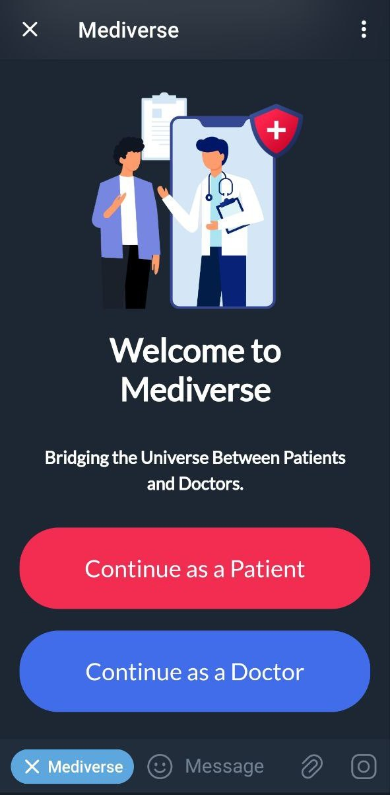

## Patient's View

### Ordered by sequence

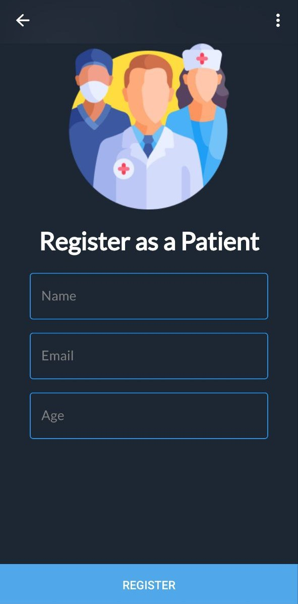
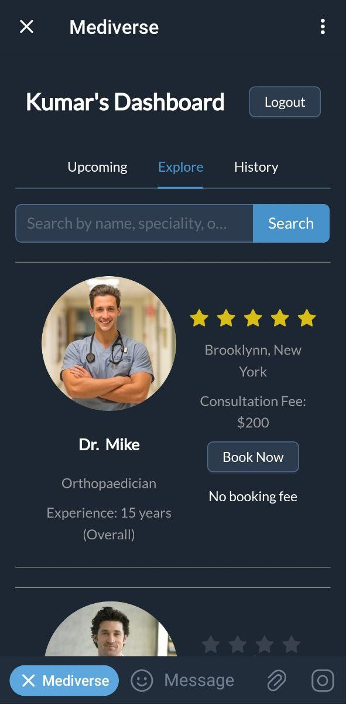
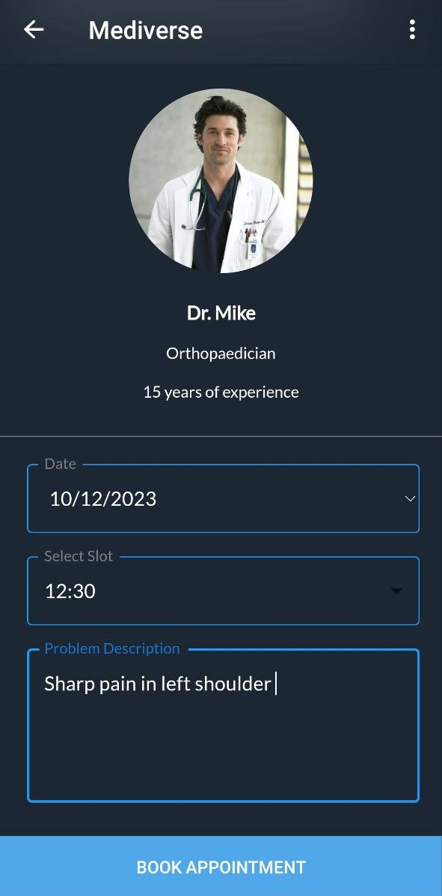
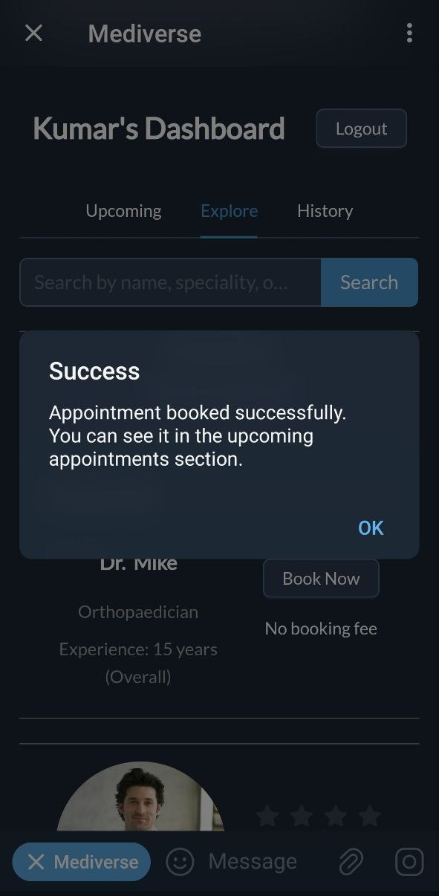
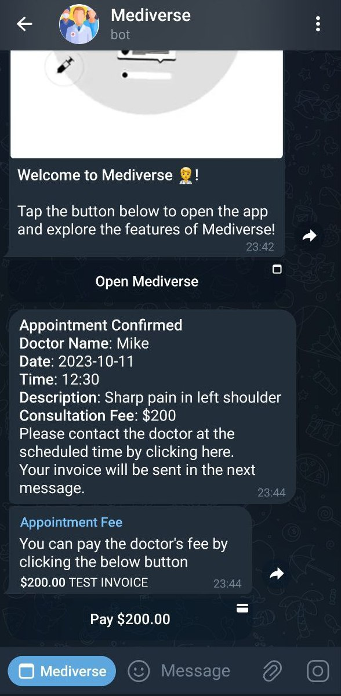
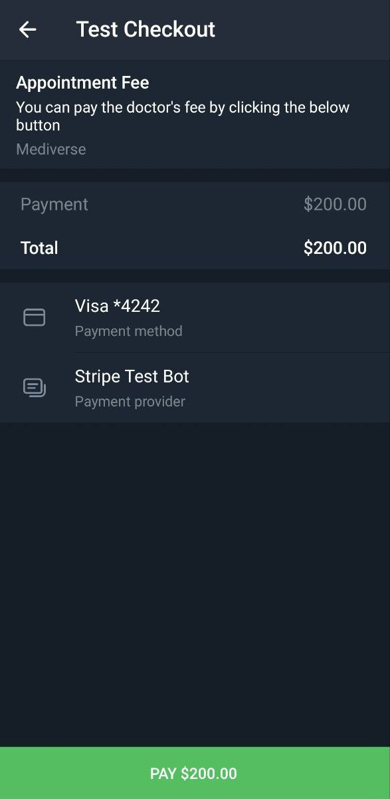
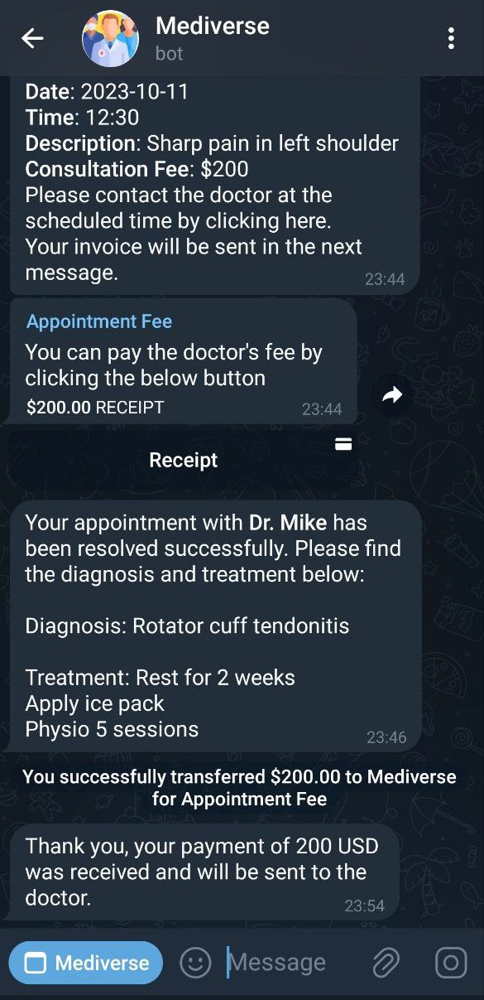
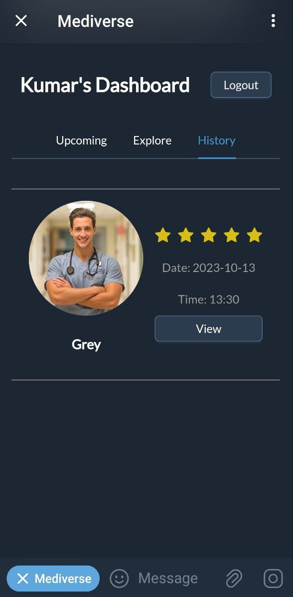

## Doctor's View
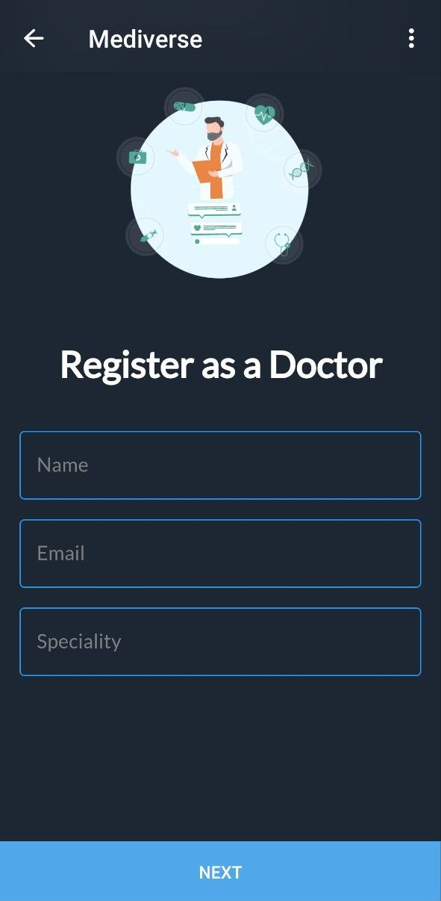
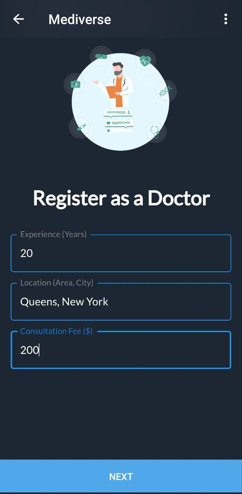
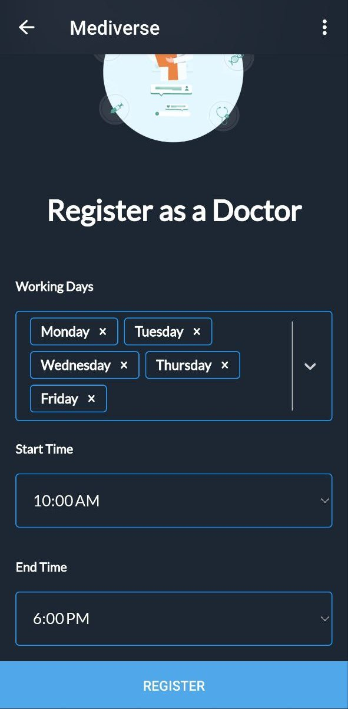
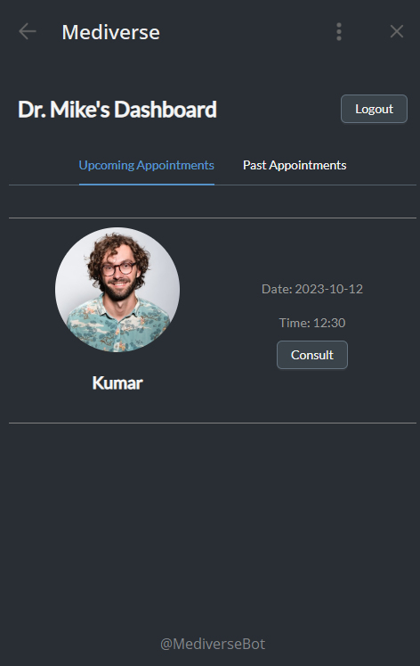
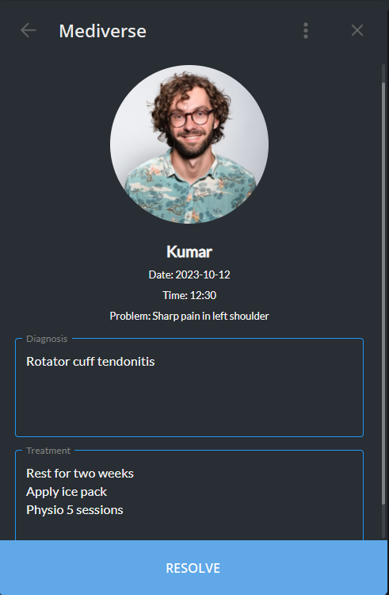
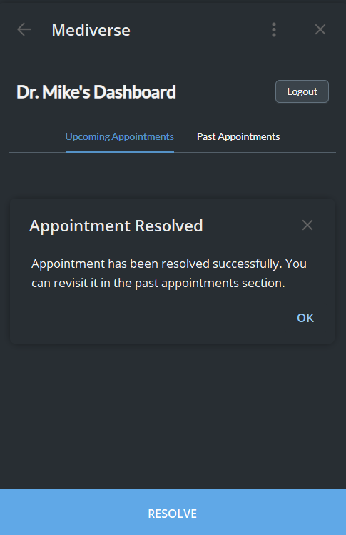

# For Developers
This project is built using vite and react.js.
## Developer Usage

```bash
# Install dependencies
npm install 
# Run the development server
npm run dev --host
# Build for production
npm run build
```
